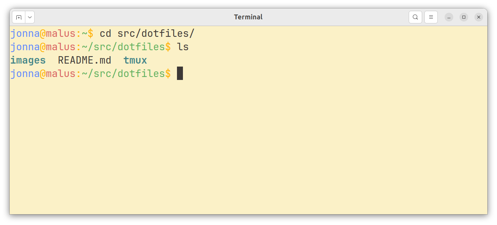

# dotfiles

This repository contains my personal dotfiles, which are configuration files for various programs and tools I use. 
Feel free to explore and utilize these configurations according to your preferences, 
but keep in mind that these settings are tailored to my specific workflow and may require adjustments 
to suit your needs.


## Table of Contents

1. [Introduction](#introduction)
2. [Usage](#usage)
3. [terminal font](#terminal-font)
4. [bash](#bash)
5. [tmux](#tmux)
6. [bashrc](#bashrc)
7. [Feedback](#feedback)


## Introduction

Dotfiles are hidden configuration files that reside in your home directory (`~`) or config directory (`~/.config`) 
and control the behavior and appearance of various programs in Unix-like operating systems - I use Ubuntu 22.04. 

This repository contains my collection of dotfiles for tools such as:

- Shell configurations (Bash)
- Terminal multiplexers (e.g., Tmux)

## Usage

Feel free to browse through the dotfiles and copy any configurations that you find useful. 
However, keep in mind the following:

- **Review Before Use:** Before applying these configurations, 
review the code to understand what each configuration does.
- **Customization:** Modify the configurations to fit your preferences and workflow.
- **Use at Your Own Risk:** These dotfiles are tailored to my specific needs. 
Using them without understanding their implications may cause unexpected behavior. Proceed with caution.

## terminal font

Download font from https://www.nerdfonts.com

**Note:** I am using `JetBrainsMono Nerd Font`.

```commandline
mv JetBrainsMono*.ttf ~/.fonts

fc-cache -fv
```

## bash

### Gnome Terminal Theme

I like to select a theme from: https://gogh-co.github.io/Gogh/

**Note:** I am using `Gruvbox` with color0 changed to `#3C3836`.



Import theme:

```commandline
bash -c "$(wget -qO- https://git.io/vQgMr)" -- "Gruvbox"
```

## tmux


Setup using Symlink from the expected location to this location and reload the configurations:

```commandline
ln -s ~/src/dotfiles/tmux/tmux.conf ~/.tmux.conf
tmux source-file ~/.tmux.conf
```

For installing and loading tmux plugins I use tpm: https://github.com/tmux-plugins/tpm. 
> Press `ctrl+b + I` (capital i, as in Install) to fetch the plugins.

## bashrc

Add `. ~/.bashrc_custom` to your bashrc file and copy `.bashrc_custom` (no symlink here as I expect bashrc_custom to further be customized):

```commandline
cp ~/src/dotfiles/bash/bashrc_custom ~/.bashrc_custom
```


## Feedback

Suggestions and improvements are welcome!
